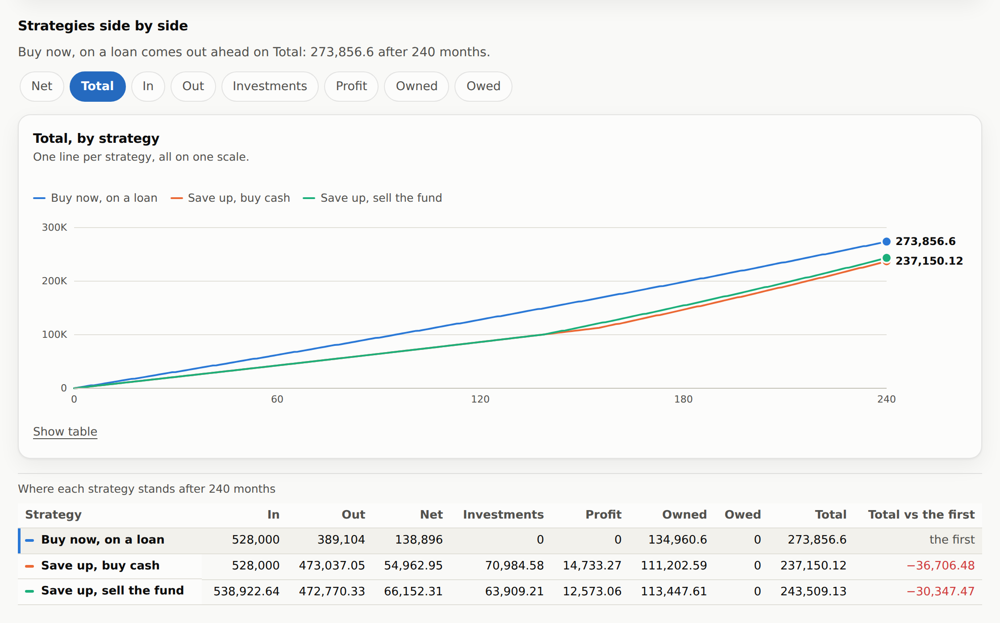
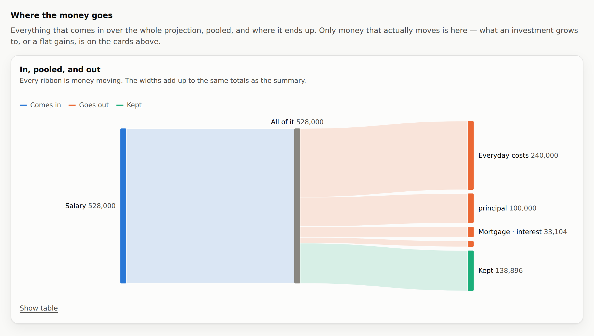

# Finapp

**Estimate your financial future in the browser.** List what comes in and what
goes out each month, choose a horizon, and read the curves — for one plan or
for several, side by side.

[](https://github.com/sinikebe/finapp/actions/workflows/ci.yml)
[](https://sinikebe.github.io/finapp/)
[](package.json)
[](CONTRIBUTING.md)
[](LICENSE)
[](https://claude.com/claude-code)

### [Open it &rarr;](https://sinikebe.github.io/finapp/)

Nothing to install and nothing to sign up for: it is a page, and it keeps
working offline once you have opened it.

[](https://sinikebe.github.io/finapp/)

It plots three cumulative curves — income, expenses and net — over the months
ahead, plus what you are worth in total once there is a balance sheet to speak
of. Everything runs on the device: no build step, no dependencies, no account,
and nothing about you leaving the machine it is typed on. The whole thing is
static files served from a folder.

*Interface disponible en français : l’application détecte la langue du
navigateur et le bouton **FR / EN** dans l’en-tête permet d’en changer à tout
moment.*

## Fields

**Everything you enter is a field, and every field is the same kind of thing.**
Income and rent are simply the two the app starts with — not special cases, not
privileged code paths. Any field can be renamed, switched between income and
expense, duplicated or deleted, the starting two included. Nothing in the app
reaches for a field by name.

A field is defined once, in [`assets/js/fields.js`](assets/js/fields.js): a
name, a **direction** — income or expense, which is what carries the sign, so
no amount is ever negative — an amount, a **period** counted in months rather
than named, so the projection can do arithmetic with it, a **kind**, a yearly
rate, and a **window**: the first and last month it can land, both empty by
default, which is what every field written before windows existed reads as.

Five kinds, all the same shape:

- **Amount** — the default. It lands every period, and climbs by its rate a
  year if you give it one, stepping on the anniversary of its first landing
  rather than a little each month, because that is when a raise arrives.
- **One-off** — one month and done: a car, a deposit, a bonus.
- **Loan** — you enter **the amount you need in hand**, any fees the lender
  adds on top, the yearly rate and the number of payments; the app works out
  the level repayment. The interest is added to what you asked for rather than
  taken out of it, and the fees are lent along with it, because that is the
  direction the arithmetic actually runs in. A loan points either way: outgoing
  when you repay one, incoming when you are repaid.
- **Investment** — contributions leave your cash like any other outgoing, and
  each balance compounds monthly at its own return. Selling turns the balance
  into cash and ends the holding; nothing is created, so what you are worth
  does not move on the day of the sale — that is the test.
- **Something you own** — a flat, a car, anything with a value. It moves no
  cash in any month: it is worth what it is worth and gains at its own rate. It
  exists so that a loan has something to be set against.

**The rate slot means something different for each kind** — interest on a loan,
the return on an investment, appreciation on a thing you own, a raise on a
plain amount — which is the one trap in the model and the one the tests watch
hardest.

A field lands at the end of each of its periods, so a lumpy year reads as a
staircase rather than a smooth line that never matches anyone's bank balance.
Because of that there is no single "per month" figure once a yearly bill is in
the list, and the summary reports the average over the horizon instead.

Input is coerced rather than trusted, and read in whichever notation it was
written in: spaces of every width group, and a comma is a decimal point except
where it is plainly grouping, so a French reader typing `12,50` into a box
showing `674 379,24` gets twelve-fifty rather than `1250`. Amounts carry no
currency symbol — the app never asks which currency you use, so it never claims
to know.

## Strategies

A strategy is a named set of fields — *what I do now*, *if I buy the flat*, *if
the raise goes into the index fund*. Strategies share one horizon, so their
curves can be read against each other, and share nothing else. A lone strategy
is unnamed and the comparison view stays hidden, so a reader who never compares
anything never meets the idea, and **Add a strategy** duplicates the one you
are looking at, because the question is nearly always *what if I changed this
one thing*.

**Four is the ceiling, and the reason is the palette rather than the model** —
four is how many series colours stay distinguishable in every pair, for a
reader with colour-vision deficiency, in both themes.

A comparison only tells you something if two plans differ in **one** place, so
a field can be **synced**: then it is one field that every strategy holds, and
changing it anywhere changes it everywhere. A counterpart is found by id first,
by name at the moment you sync it — which is what makes this work on plans
built before anyone thought to link them — and by likeness for a row nobody
named. Removing a synced field removes it everywhere, because it is one field.

**Each tab says where its plan came from**: one of the three the app opens with,
one you made, one somebody shared with you, or one somebody shared that you have
changed since — which is a different thing to know, and is worked out by keeping
a record of what arrived and comparing the plan against it. Ids are left out of
that comparison, because the same plan on two devices has different ids for the
same fields.

The mark is a muted leading edge rather than a bright dot, and its colours come
from the two bands the palette leaves empty. That is not decoration: colour in
this app already means series on the flow cards and strategy in the comparison,
and a vivid dot on a tab would read as a legend swatch saying which line in the
chart that plan is. Every tab also says its origin in words, on hover and to a
screen reader, so the colour is never carrying it alone.

Once there is a second strategy, a chart draws them all on one scale and a
table gives each one's totals and its gap to the first. **That gap is measured
on the total, not the net**: a plan that pours everything into a fund keeps
almost no cash, and judging it on net would announce it as behind directly
above a chart showing it well ahead. In that view **colour means strategy**;
the flow cards keep colour for series, and neither asks it to carry two things
at once.

## What it computes

The model lives in [`assets/js/projection.js`](assets/js/projection.js) and is
deliberately the simplest thing that is honest:

```
contribution(f, m) = before f.startMonth, or after f.endMonth → 0
                     once      → m === f.startMonth ? f.amount : 0
                     loan      → m within term of its first payment ? payment(f) : 0
                     otherwise → (m − f.startMonth) % f.periodMonths === 0 ? f.amount : 0
income(m)          = income(m−1)   + Σ contribution(income fields, m)
expenses(m)        = expenses(m−1) + Σ contribution(expense fields, m)
net(m)             = income(m) − expenses(m)
invested(m)        = Σ over investments of
                       balance(f, m−1) × (1 + f.annualRate/12) + contribution(f, m)
contributed(m)     = Σ paid into investments so far
profit(m)          = gain > 0 ? gain × (1 − tax) : gain,  gain = invested − contributed
owned(m)           = Σ assets, each gaining at its own rate
                     + principal still outstanding on loans owed *to* you
debt(m)            = principal still outstanding on loans you are repaying
worth(m)           = net(m) + invested(m) + owned(m) − debt(m)
```

for `m = 0 … X`, where month 0 is today — nothing earned, nothing paid.

**`worth` is the bottom line: the whole balance sheet.** Adding the balances
back is a sum rather than double-counting, because money put into an investment
has already left `net` as an outgoing — the two halves never hold the same coin
at the same time. The flows start at zero because nothing has flowed yet;
**the balances do not**, because you already own what you own and owe what you
owe, so `worth` at month 0 is your net worth today rather than a polite zero.

That is what makes a repayment read correctly. Clearing principal moves cash
and debt by the same amount, so **only the interest in a payment makes anyone
poorer** — which is why a mortgage of 120,000 at 6% over ten years costs
exactly its interest against `worth`, not the 160,000 that leaves the account.

**`contributionOf(field, month)` is the one function that decides what a field
moves in a given month.** The series are accumulated month by month rather than
multiplied, which is what lets a field's contribution vary over time, and
amounts are rounded to whole cents at every step, so what you read is what adds
up. The horizon is clamped to 1–600 months, and both a single field and the sum
of a direction are capped at a hundred billion a month — which is what keeps
every total inside the range where a double still holds cents exactly.

Three switches sit over the whole projection:

- **In today's money** divides every figure at month *m* by one deflator,
  `(1 + i)^m` — what that pile would buy now. One factor per month is what
  makes it safe: it leaves every identity standing, so net is still income less
  expenses and worth is still the balance sheet.
- **Show a range** re-runs the projection with every *return* moved down and up
  by a few points and shades the region between. Loan interest is left where it
  is — what a loan costs was agreed, not guessed — and the pessimistic run may
  go negative, because a bad decade should read as a loss rather than bottoming
  out at flat.
- **Tax on gains**, applied to the gain and nothing else. A loss is never taxed
  and never handed back as a credit, and tax never touches `worth`: the total
  is what you hold, and the bill falls due on a sale the app has no way to know
  you will make.

## What it draws

Line charts hand-drawn as SVG in [`assets/js/chart.js`](assets/js/chart.js).
One component draws every chart in the app: it takes a list of series and lays
out however many it is given.

- **Two readings of the same cards.** *Running total* draws the curves that
  climb. *Each month* draws what that month moved on its own — the one question
  a running total cannot answer, because a curve that only ever climbs hides
  every month it climbed by less than nothing. It is a first difference of the
  series the model already produces, so nothing was added to the model to get
  it, and the table under each card reads the same way the chart does. It is a
  toggle on the cards rather than a sixth card: five series colours is the
  ceiling, and a new card would need a colour that does not exist.
- **One shared vertical scale** across the flow cards, so the curves can be
  read against each other — two y-scales on one plot would invent a correlation
  that isn't in the data. The investment-value card is the exception and says
  so: a balance is not a cumulative flow, and would flatten to nothing on the
  flows' axis.
- **Series colours** come from a validated categorical palette, every pair
  clearing the colour-blind and normal-vision separation floors in both light
  and dark mode — dark being a selected palette rather than an inverted one.
  Five slots is the ceiling: a sixth that clears the floors beside these sits
  at the chroma where a colour starts reading grey, so debt is a tile and a
  comparison column instead.
- **Nothing is gated behind hover.** Each line is labelled at its endpoint, a
  crosshair tooltip follows the pointer and the arrow keys, hovering one flow
  card moves all three, and every card has a table view with the exact monthly
  figures. A band is painted under everything at low opacity, and its bounds
  are columns in that table, because no figure in this app lives only inside a
  drawing.

Below the cards, a **Sankey**: every income field into a pool, and the pool out
to every expense field plus whatever is kept. **The pool is load-bearing** —
money is fungible and nothing in the model says which salary paid which bill,
so ribbons drawn income-to-expense would invent an allocation nobody entered.
Only a conserving cut of the model can be drawn and there is exactly one,
`income = expenses + net`; growth, appreciation and drawn loan principal enter
`worth` with no source, so they stay on the cards above. Widths are apportioned
out of the totals rather than summed beside them, so the parts add up to the
tile by construction rather than by luck. A loan arrives as the parts its
repayments are actually made of — principal, fees and interest, named rather
than coloured, because the diagram seats three tones and they already mean in,
out and left over. When you spend more than you earn the leftover node changes
sides rather than going negative, and a flow too thin to see is given a floor
rather than allowed to vanish.



## What it opens on

An empty form answers nothing, so the app opens on one question asked three
ways: **how should I buy a 100,000 house?** Buy now on a loan; save up and buy
cash; or save up and sell the index fund too. All three spend exactly the same
on housing every month, so the only thing being compared is *when you own the
house* — and once a plan's housing is paid for, that money goes back into the
fund, so the comparison does not quietly become one about what people do with
spare cash.

The lesson is not a single one. Over twenty years borrowing wins by about
30,000 — not because loans are free, the interest is 33,104, but because it
owns an appreciating house eleven years earlier. **Slide the horizon out and
the answer reverses**: by forty years the renters are ahead by more than
100,000, because they have been compounding at 6% since year thirteen while the
house appreciates at 1.5%. The months the renters buy are computed and written
down rather than left to a rule — a test recomputes both and fails if a figure
moves without them following. A plan built today could instead name a target and
have its purchase wait on it, which is what the section below is about; these
three predate that and are kept as they were, because a worked example whose
figures move under the reader is not one.

**Start again**, in the About panel, puts the defaults back. It still asks
first, and the second click is still labelled *Replace everything* rather than
*OK*: Undo can take it back while the tab is open and not once it is closed,
which is exactly the case a confirm is for. Your language and theme are left
alone — they are preferences about reading the app, not part of the plan.

## When does that happen?

*As soon as savings reach 100,000* is not a rule the projection can obey, and it
still is not one. **A target does not need it to be**, because a target is a
reading over the result rather than a rule inside it. Mark *worth reaches
250,000*, or *debt clear*, or *the fund covers the house*, and the app scans the
months for the first one where it is true and says so in words. The month is
marked on the flow cards as a neutral dashed rule carrying its number — the same
treatment the investment card's *paid in* line already gets, and for the same
reason: a reference is not a category, so it takes no slot in a palette with
none left to give. The rule is drawn in both readings, because it marks the
month a target is met and is not a feature of the curve it is drawn over.

A target that is never met **says so** rather than falling off the end of the
chart — and then it can ask the other question. **What would it take?** takes
one of your own figures and works backwards to the value that would meet the
target, bracketing and halving over the projection itself. Two things make that
answer trustworthy. It is **checked**: the winning figure is run back through
the plan before it is shown, so the sentence is the app's own reading rather
than the solver's arithmetic. And it **refuses** where the relationship is not
monotonic — an amount and a rate are the only two figures it will solve for, and
where a total climbs and falls again it says so instead of returning whichever
crossing it found first. One of the app's own opening plans is a shape that
wobbles, and a test holds it to refusing.

The answer is shown, never applied: applying it would write over what you typed.

## Naming a target, and waiting on one

Give a target a **name** and a field can wait on it: *from* the month it is met,
*to* that month, or **sold** in it. "Buy it once the savings are there" becomes
something the plan says, instead of a month somebody worked out by hand.

**The model is still not conditional.** `contributionOf` reads three months as
numbers and has never heard of a target. What is new is a pass that runs first:
[`schedule.js`](assets/js/schedule.js) resolves the names to months and hands
the plan on with numbers in it. The name is the seam, and nothing under it knows
there was ever a question.

Resolving is circular on its face — the month comes out of a projection, and the
projection needs the month — so **the shape of that loop is the whole design,
and the obvious version is wrong.** Reading a target off the plan you just
placed makes *buy the car when savings reach 12,000* watch savings the purchase
then spends: the crossing moves to the purchase, the purchase moves to the
crossing, and the two chase each other for ever. What a reader means by *the
savings* is the ones they were putting by. So each target is read off the plan
**as it would run if that target never came**, with everything waiting on it
held back — per target, not all at once, which is what lets the second in a
chain see the first purchase and land on month 18 rather than month 12.

That also settles the confused question honestly. *Buy the house when what I own
reaches 100,000*, where the house **is** what would be owned, reads a plan with
no house in it, owns nothing, and answers **never** — a true answer to a
question that answers itself, rather than one of the two months a chase would
have alternated between.

Two targets can still move each other, and holding back cannot help when neither
is the one being held. The loop watches for a state it has been in, stops, and
**says it could not settle** — the posture the solver already takes when asked
something not monotonic. Guessing would mean picking one of two wrong answers.

A start that never comes takes its field out of the plan, which is what *has not
begun* means with no sentinel month; an end that never comes is no end, and a
sale that never comes is no sale. The row stays in the form either way, because
a row you can no longer see is a row you can no longer fix.

## Which figures decide it

A plan can hold a hundred fields, and nothing on the page said which two of them
decide where it ends up. So a ranked list moves each amount on its own, runs the
whole projection again, and orders the fields by how far the answer moved. It is
a list rather than a chart, which is what keeps it out of the palette.

Two things are said on the card rather than left to be discovered. It measures
**this plan at this horizon**, not a general truth — the plans the app opens
with reverse their order somewhere between year twenty and year forty. And the
swings **do** add up, because the model is separable by construction, which is
precisely why the list cannot tell you that a mortgage bought a house: it ranks
the figures, not the reasons. Profit is the one exception, tax falling on the
aggregate gain rather than on each part of it.

## Taking something back

Five things throw work away: removing a field, removing a strategy, removing a
target, *Start again*, and opening a shared plan over your own. **Undo** takes
back the last ten of them.

It is cheap because the model operations were already pure and already returned
new lists, so a snapshot is the plan exactly as the store would have written it,
deep-copied through the same serialisation. It does not step back through your
typing: the snapshot is taken by the command rather than the keystroke, so Undo
means *before I deleted that* and not *before I typed the 4*.

**It lasts as long as the tab.** Nothing is written down, so closing the tab is
still what makes a change final — which is why the confirms stay. And when
another window's changes arrive, this tab throws its stack away before adopting
them: a snapshot of plans that window has since replaced would otherwise be one
press away from overwriting somebody's work, from a window nobody is looking at.

## Handing a plan to somebody

There is no account to share from and no copy on a server to link to, so **the
link is the copy**. *Share* packs the whole configuration — every strategy,
every field, any targets, the horizon and the assumptions — into the
**fragment** of a URL,
which is the one part of an address a browser never sends to a server. The plan
travels wherever you paste it and nowhere else, which is the same promise the
rest of the app makes, kept in the one place where it has to let go. Anyone who
has the link has the plan, and the panel says so before you send it.

Nothing is compressed, and that is a decision rather than an omission.
`CompressionStream` would roughly halve the link and sits above this app's
browser floor — so a link written in one browser could not be opened in
another, which for a thing whose whole purpose is to be opened elsewhere is the
worst failure available. Instead the plan is packed: attributes travel by
position, only where they differ from the default, and an id — which means
nothing on another device — travels as a slot number. Two synced fields share
one slot, so *the sameness survives the trip even though the id must not*, and
the far end mints its own ids. One plan of four fields is a 400-character link;
the three the app opens with, which is the largest thing it can produce
unaided, is under 2,500. A test holds both.

Opening one **adds it beside your own plans rather than over them**. Comparing
it against what you already have is the reason to open one at all, so replacing
would throw away the very plan you wanted to compare against. Four plans is
still the ceiling, so the panel says how many will fit, and a list already full
is the one case where opening costs something — there the button says *Replace
my plans* outright and is coloured like the one other button in the app that
throws something away.

The horizon and the assumptions *do* come from the shared plan, because
strategies share one horizon by construction: there is no arrangement where both
readings survive, and a plan built over forty years read at five says nothing.
That is a slider away; a discarded plan is not.

It **asks first** either way, the way *Start again* asks: focus on keeping what
you have, and your language and theme left alone. The link is taken out of the
address whatever you answer — a refusal must not be re-asked by every refresh,
and an acceptance must not have a reload put the shared plan back over whatever
you did next — and the question is asked again on a fragment that changes
without a load, which is what pasting a link into a tab already showing the app
does. And a link is read as exactly as trustworthy as a hand-edited store:
everything in it goes through the model's own coercion, so nothing a link can
say puts a value in the app that the app could not have made itself.

## Your data, and the app itself

Four keys in `localStorage`, on your device only: your strategies, horizon and
assumptions under one, your theme and language under two more, and the time the
app last looked for a new version under the fourth. Older stores are migrated on
first load and retired only after the new one is written, so a failed write
leaves what you had typed where it was. **Nothing about you is sent anywhere**:
after the app has loaded its own files, the only request it ever makes is the
one that asks whether a newer version exists. The undo stack is deliberately
**not** a fifth key: a list of your previous plans, left on disk, is something a
shared device would still be holding tomorrow.

`sw.js` treats its cache as one immutable generation: the page, the CSS and the
JS are precached together and served together from that same generation, so you
never get a fresh page wired to stale scripts. A new version therefore arrives
whole — a new worker installs its own cache alongside the running one, and the
app offers a **Reload** button rather than swapping the page out mid-edit. It
looks for one when you open the app and no more than once an hour, and **Check
for updates** in the About panel asks whenever you want. That panel carries the
build and the changelog, and reads its version from the generation the worker
is actually serving, which is the question it exists to answer.

The interface ships in English and French. The app picks the browser's language
if it speaks it, the header toggle overrides that, and number formatting
follows the same choice. French typography — the no-break space before a colon,
and inside a pair of guillemets — belongs to the dictionary rather than to the
views, and a test holds three files to it.

## Browser support

Any browser with ES modules, `Intl.NumberFormat`, CSS custom properties,
`ResizeObserver` and `<dialog>` — Chrome/Edge 88+, Firefox 98+, Safari 15.4+.
`<dialog>` is what moves the floor: without `showModal` the About panel cannot
open. Later niceties degrade rather than break, so an older engine gets a
plainer app and not a broken one, and the app falls back to a plain page where
service workers are unavailable. Installability depends on the browser:
Chromium prompts, Safari installs through *Add to Home Screen*.

## Built with Claude Code

**Finapp was written with [Claude Code](https://claude.com/claude-code)** — the
app, its tests, its French translation and this documentation. Every feature
arrived as a pull request opened from a Claude Code session and squash-merged
after CI; the co-author trailers are in the history, and the About panel's
changelog is the same list read from the other side.

That is also why the repository is shaped the way it is. The rules an agent has
to be held to are the rules that keep a codebase honest anyway: one seam per
kind of change, model operations that are pure, a test for every claim the
documentation makes out loud, and CI that fails the build when the service
worker's cache version falls behind the files it serves.

## Contributing

**Issues are open to everyone** — a bug, a figure that reads wrong, a question
about why something is the way it is, an idea for a kind of field. Pull
requests are limited to collaborators, so open an issue rather than a
fork-and-PR; the reasoning, and what to do with a patch you have already
written, is in [CONTRIBUTING.md](CONTRIBUTING.md), along with how to run it,
what lives where, and the two manual steps a release needs.

## License

[MIT](LICENSE).
